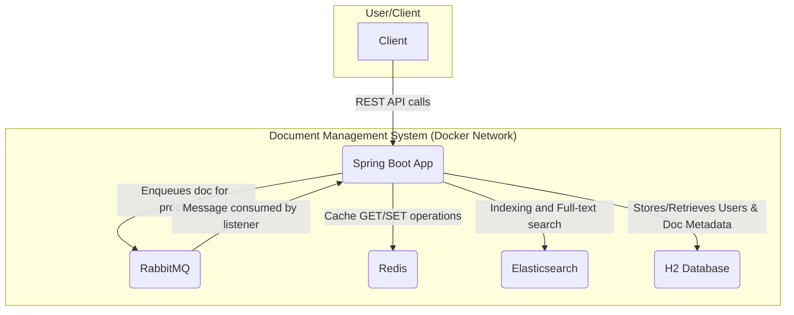

# Document Management and Basic Q&A Application 

## Overview

This project is a comprehensive Document Management System built with Spring Boot. It provides a secure and scalable backend for uploading, processing, searching, and managing documents. The system leverages a microservices-inspired architecture using Docker Compose to orchestrate various services, including Elasticsearch for powerful full-text search, RabbitMQ for asynchronous document processing, and Redis for high-speed caching.

The application is secured using JWT-based authentication and provides role-based access control (ADMIN, EDITOR, VIEWER) for its APIs.

## Features

-   **Secure Authentication:** JWT-based authentication and authorization.
-   **Role-Based Access Control:** Granular permissions for different user roles (ADMIN, EDITOR, VIEWER).
-   **Asynchronous Document Upload:** Documents are uploaded and processed asynchronously using RabbitMQ, preventing long-running requests.
-   **Content Extraction:** Apache Tika is used to extract text content from various document formats (PDF, DOCX, etc.).
-   **Full-Text Search:** Powerful search capabilities over document content powered by Elasticsearch.
-   **Caching Layer:** API responses for documents and search queries are cached using Redis to improve performance.
-   **In-Memory Database:** Uses H2 as an in-memory database for storing document metadata and user information.
-   **Batch Processing:** Includes a Spring Batch job to import documents from a CSV file.
-   **Containerized Deployment:** The entire application stack is containerized using Docker and managed with Docker Compose for easy setup and deployment.
-   **API Documentation:** Interactive API documentation is provided via SpringDoc (Swagger UI).

## Technologies Used

-   **Backend:** Spring Boot 3.2.5, Java 17
-   **Database:** H2 (In-Memory)
-   **Search:** Elasticsearch 7.17.13
-   **Messaging:** RabbitMQ
-   **Caching:** Redis 7
-   **Security:** Spring Security, JSON Web Tokens (JWT)
-   **API Documentation:** SpringDoc OpenAPI 3 (Swagger UI)
-   **Content Extraction:** Apache Tika
-   **Batch:** Spring Batch
-   **Containerization:** Docker, Docker Compose
-   **Build Tool:** Maven

## Architecture

The system is composed of several services that work together. The Spring Boot application is the central component, handling all business logic and API requests. It communicates with the other services for specific tasks.



## Design Patterns Used

This project leverages several common design patterns to ensure a clean, maintainable, and scalable architecture. Understanding these patterns can help new developers grasp the codebase more quickly.

-   **Model-View-Controller (MVC):** This is a core pattern used by Spring Boot.
    -   **Model:** Represents the data (e.g., `Document`, `User` classes).
    -   **View:** The JSON data returned by the REST APIs.
    -   **Controller:** Handles incoming requests and orchestrates the response (e.g., `DocumentController`, `AuthController`).

-   **Service Layer:** This pattern separates business logic from other parts of the application, like the web controllers.
    -   **Example:** `DocumentService` and `QnAService` contain the main business logic for managing and searching documents.

-   **Repository:** This pattern abstracts the data persistence layer, making it easier to manage database operations.
    -   **Example:** `DocumentRepository` and `UserRepository` provide an interface to interact with the H2 database without writing raw SQL.

-   **Data Transfer Object (DTO):** DTOs are used to transfer data between the client and the server. They help prevent exposing the internal database models directly to the API.
    -   **Example:** `DocumentDTO` is used to send a simplified version of the `Document` object in API responses.

-   **Singleton:** By default, Spring creates all its beans (like services, controllers, and repositories) as singletons. This means there is only one instance of each of these classes in the application, which saves memory and improves performance.

-   **Observer:** The asynchronous communication using RabbitMQ follows the Observer pattern. The `DocumentQueueListener` "observes" the message queue. When a new document is uploaded and a message is published, the listener is notified and processes the document.

-   **Chain of Responsibility:** Spring Security's filter chain is a perfect example of this pattern. Each incoming request passes through a series of filters. Each filter can process the request or pass it to the next one in the chain.
    -   **Example:** Our `JwtRequestFilter` checks for a valid JWT token in the request before it reaches the controller.

-   **Factory (Dependency Injection):** Spring's Inversion of Control (IoC) container acts as a factory. Instead of our classes creating their own dependencies, the Spring container "manufactures" and injects them where needed. This makes the code more modular and easier to test.

## Project Setup

### Prerequisites

-   Docker and Docker Compose
-   Java 17 and Maven (for local development outside Docker)
-   A tool for API testing like `curl` or Postman.

### Running with Docker Compose

1.  **Clone the repository:**
    ```bash
    git clone <repository-url>
    cd document-management
    ```

2.  **Build and run the services:**
    Use Docker Compose to build the application image and start all the services.
    ```bash
    docker-compose up --build -d
    ```
    This command will start the Spring Boot application, Elasticsearch, RabbitMQ, and Redis containers.

3.  **Verify the services:**
    -   **Application:** The application will be running at `http://localhost:8080`.
    -   **Swagger UI:** Access the interactive API documentation at `http://localhost:8080/swagger-ui.html`.
    -   **H2 Console:** Access the H2 database console at `http://localhost:8080/h2-console`.
        -   **JDBC URL:** `jdbc:h2:mem:testdb`
        -   **Username:** `sa`
        -   **Password:** (leave blank)
    -   **RabbitMQ Management:** Access the RabbitMQ dashboard at `http://localhost:15672`.
        -   **Username:** `guest`
        -   **Password:** `guest`
    -   **Elasticsearch:** Check the cluster health:
        ```bash
        curl http://localhost:9200/_cluster/health?pretty
        ```
    -   **Redis:** Ping the Redis server:
        ```bash
        docker exec -it redis redis-cli ping
        ```
        (Should return `PONG`)

## API Endpoints and Testing

All secured endpoints require a JWT token. Follow these steps to get a token and test the APIs.

### 1. Register Users

First, register users with different roles using the `/api/auth/register` endpoint in Swagger UI.

-   **Endpoint:** `POST /api/auth/register`
-   **Role: `ADMIN`**
    ```json
    {
      "username": "admin.user",
      "password": "password123",
      "role": "ADMIN"
    }
    ```
-   **Role: `EDITOR`**
    ```json
    {
      "username": "editor.user",
      "password": "password123",
      "role": "EDITOR"
    }
    ```
-   **Role: `VIEWER`**
    ```json
    {
      "username": "viewer.user",
      "password": "password123",
      "role": "VIEWER"
    }
    ```

### 2. Login and Get JWT Token

Next, log in with a registered user to get a JWT token.

-   **Endpoint:** `POST /api/auth/login`
-   **Request Body:**
    ```json
    {
      "username": "editor.user",
      "password": "password123"
    }
    ```
-   The response will be the JWT token string. Copy this token.

### 3. Authorize in Swagger UI

-   Click the **Authorize** button at the top of the Swagger UI page.
-   In the dialog, enter `Bearer <your_jwt_token>` (e.g., `Bearer eyJhbGciOi...`).
-   Click **Authorize**. You can now test the secured endpoints.

---

### Authentication API (`/api/auth`)

| Endpoint           | Method | Description                                  | Permissions |
| ------------------ | ------ | -------------------------------------------- | ----------- |
| `/register`        | `POST` | Registers a new user (`ADMIN`, `EDITOR`, `VIEWER`). | Public      |
| `/login`           | `POST` | Authenticates a user and returns a JWT token.  | Public      |
| `/logout`          | `POST` | Logs out the user (client-side token removal). | Public      |

### Document Management API (`/api/documents`)

| Endpoint           | Method | Description                                                                                               | Permissions      |
| ------------------ | ------ | --------------------------------------------------------------------------------------------------------- | ---------------- |
| `/upload`          | `POST` | Uploads a document file and its metadata. The file is processed asynchronously.                           | `ADMIN`, `EDITOR` |
| `/`                | `GET`  | Retrieves a paginated list of documents. Supports filtering by `author`, `type` and sorting.              | `ADMIN`, `EDITOR` |

#### Example: Upload Document

-   **Endpoint:** `POST /api/documents/upload`
-   **Request Type:** `multipart/form-data`
-   **Parts:**
    1.  `file`: The document to upload (e.g., a `.pdf` or `.docx` file).
    2.  `metadata`: A JSON string with document metadata.
        -   **Key:** `metadata`
        -   **Value:** `{"author": "editor.user", "type": "PDF"}`

### Q&A and Search API (`/api/qa`)

| Endpoint           | Method | Description                                       | Permissions                |
| ------------------ | ------ | ------------------------------------------------- | -------------------------- |
| `/search`          | `GET`  | Performs a full-text search on indexed documents. | `ADMIN`, `EDITOR`, `VIEWER` |

#### Example: Search Documents

-   **Endpoint:** `GET /api/qa/search`
-   **Query Parameter:**
    -   `query`: The keyword or phrase to search for.
-   **Example Request:** `GET /api/qa/search?query=spring framework`

## Batch Processing

The application includes a Spring Batch job named `importDocumentJob`.

-   **Functionality:** This job reads document data from a `documents.csv` file located in the `src/main/resources` directory.
-   **Process:** It reads each row, processes it, and saves it as a `Document` entity in the H2 database. The processor also caches the document in Redis.
-   **Trigger:** This job is configured to run on application startup. To use it, you need to create a `documents.csv` file with the appropriate columns (`id,title,content,author,type`) in the resources folder before building the project.

## Troubleshooting

-   **`docker-compose up` fails:** Ensure Docker is running and that ports `8080`, `9200`, `5672`, `15672`, and `6379` are not in use by other applications.
-   **H2 Console Access Denied:** Make sure you are using the correct JDBC URL (`jdbc:h2:mem:testdb`) and that the `spring.h2.console.settings.web-allow-others` property is set to `true` (which is the default in `application.properties`).
-   **403 Forbidden Error:** This means you are trying to access an endpoint with a user role that does not have permission. Check the API documentation above for the required roles for each endpoint. Ensure your JWT token is valid and passed correctly in the `Authorization` header.
-   **Connection Refused Errors (to Redis, RabbitMQ, etc.):** If running the app locally (outside Docker), make sure to update the hostnames in `application.properties` from service names (e.g., `redis`) to `localhost`.
